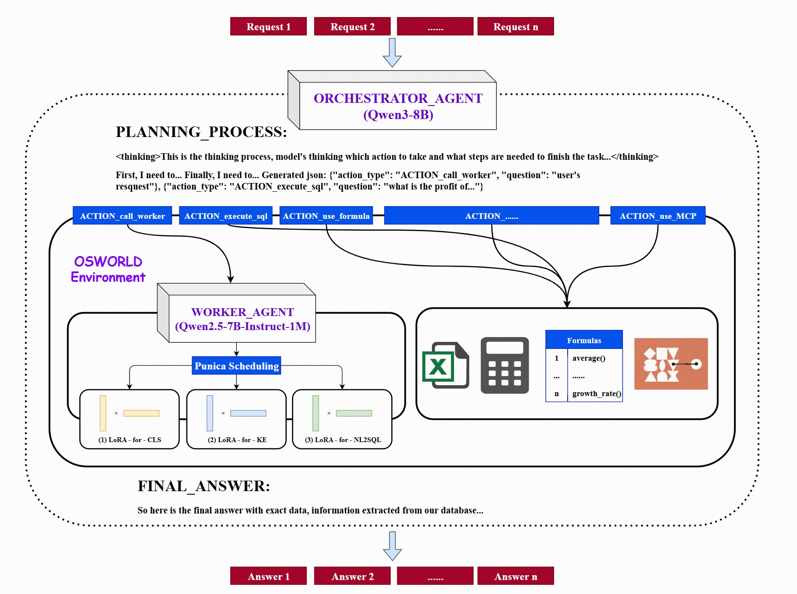
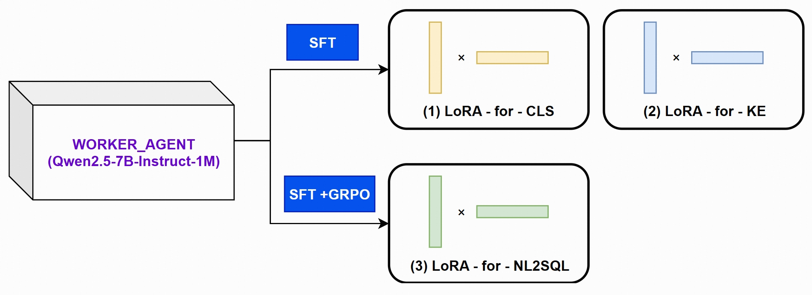

# FinTalk.ai

**A Grounded Orchestration Framework for Multi-Agent Collaboration on Financial Tasks Leveraging the OSWorld Environment**

<p align="center">
  <a href="LICENSE"></a>
  <a href="#"></a>
  <a href="#"></a>
</p>

### Overview

FinTalk.ai represents a paradigm shift in applying Large Language Models to the financial sector. It is an end-to-end, multi-agent framework designed to bridge the chasm between the generative capabilities of LLMs and the stringent, data-driven demands of financial analysis.

<p align="center">
  
</p>

Operating within a secure and reproducible **OSWorld Environment**, FinTalk.ai employs a sophisticated **Orchestrator-Worker architecture** to interpret complex, natural language queries, interact with proprietary structured databases, perform deterministic computations, and synthesize factually grounded, trustworthy intelligence. It is engineered to solve the fundamental challenges of data privacy, computational cost, and LLM hallucination, providing a scalable blueprint for next-generation financial AI assistants.

### The FinTalk.ai Philosophy

Our design is guided by three core principles:

1.  **Grounded Cognition:** Every piece of information presented to the user must be traceable to a verifiable source—a specific row in our database or the result of a deterministic calculation. We systematically eliminate opportunities for factual hallucination.
2.  **Resource-Efficient Scalability:** We reject the brute-force approach of deploying numerous large models. Our architecture is optimized for maximum capability with a minimal resource footprint, making advanced AI accessible and operationally viable.
3.  **Verifiable and Reproducible Research:** By building upon a standardized environment like OSWorld, we ensure our framework is not a black box. Its operations are transparent, and its performance is robustly and reproducibly measurable.

### Core Innovations

FinTalk.ai is not merely an application of existing technologies but a synthesis of several novel approaches to solve foundational problems in applied AI.

#### 1. The Asymmetric, Resource-Efficient Multi-Agent Architecture
We address the scaling dilemma of multi-agent systems with an asymmetric design. Instead of deploying multiple monolithic models, we utilize a single, powerful **Orchestrator Agent (`Qwen3-8B`)** for high-level cognition and a single, lightweight **Worker Agent (`Qwen2.5-7B-Instruct-1M`)** that embodies a suite of specialized skills. By leveraging **Punica Scheduling** to dynamically serve task-specific **LoRA adapters**, our Worker Agent functions as an on-demand team of experts (Classifier, Keyword Extractor, NL2SQL Coder) while maintaining the inference cost and memory footprint of just one model.

#### 2. The Grounded Orchestration Pipeline
To combat the stochastic and unreliable nature of LLM calculations, we introduce a **Decomposition and Grounding** pipeline. The Orchestrator strictly adheres to a ReAct-style, closed-loop reasoning process. It deconstructs complex queries into a sequence of atomic operations: delegating structured data translation, executing verifiable SQL queries against the database, and channeling the precise numerical results into a deterministic **Formula Tool**. This rigorously enforced separation of cognitive planning from deterministic execution guarantees factual and mathematical accuracy.

#### 3. Privacy-Preserving Synthetic Data Engine
We solve the "data scarcity and privacy paradox" for NL2SQL training with a novel synthetic data generation engine. This pipeline leverages a powerful external LLM (`DeepSeek`/`Gemini`) in a zero-knowledge fashion. By providing only the database **schema** and employing a **dynamic prompt generation** strategy—which randomizes few-shot examples and provides in-context negative feedback to avoid repetition—we stimulate the creation of a massive, diverse, and complex training curriculum. Crucially, **vector-based semantic deduplication** using **Qwen3-Embedding-8B** ensures the quality and diversity of the final dataset, all without ever exposing the sensitive proprietary data to an external service. The script for this engine is available at `data_generation/generate_sft_data.py`.

#### 4. The Standardized Agentic Testbed
The entire framework is built upon the **OSWorld Environment**, which serves as a secure, sandboxed, and standardized "operating theater" for all agent actions. This is more than a technical choice; it is a commitment to rigorous and scientific evaluation. It ensures that our experiments are not only secure but also robust and reproducible, setting a benchmark for the development and assessment of financial AI agents.

### System Architecture Deep Dive

The architecture is a dual-agent system operating within OSWorld:

#### The Orchestrator Agent: The Cognitive Hub
-   **Model:** `Qwen3-8B`
-   **Role:** Acts as the central nervous system. It is responsible for high-level reasoning, strategic planning, multi-step task decomposition, and final answer synthesis.
-   **Deployment:** Served via **vLLM** for optimized, high-throughput inference.

#### The Worker Agent: The On-Demand Specialist Team
-   **Model:** `Qwen2.5-7B-Instruct-1M`
-   **Role:** Functions as a collection of specialized, fine-tuned tools that the Orchestrator can call upon demand.
-   **Specialized Skills (via LoRA):**
    1.  **Keyword Extraction (KE): The Semantic Front Door.** Acts as a "noise reducer" and "cognitive triage" system. It parses unstructured, colloquial user input into a structured set of entities, allowing the Orchestrator to perform **strategic routing**.
    2.  **Classification (CLS):** A mechanism to classify user intent, guiding the Orchestrator's initial strategy.
    3.  **NL2SQL:** The high-precision tool for converting clean instructions from the Orchestrator into accurate and executable SQL queries.

### The Data Foundation: Database Schema

FinTalk.ai operates on a proprietary database schema consisting of four core tables. This structured data forms the "ground truth" for all of the agent's reasoning.

#### 1. `companies` Table
The master table containing comprehensive profile information for each company, serving as the central hub.
*   **Source File:** `company.csv`
*   **Total Records:** 607

| Field Name | Data Type | Description |
| :--- | :--- | :--- |
| `company_sort_id` | INTEGER | **Primary Key.** Unique numerical identifier for each company. |
| `name` | TEXT | The official name of the company. |
| `website` | TEXT | The official website URL. |
| `employee_size`| INTEGER | A numerical representation of the total number of employees. |
| `techSummary` | TEXT | A detailed description of the company's technology stack and strategy. |
| `...` | `...` | *(A total of 39 columns, including location, status, funding, and license details)* |

#### 2. `employees` Table
A denormalized view containing high-level company information, including employee counts and tech summaries.
*   **Source File:** `employee_noTech.csv`
*   **Total Records:** 1,079

| Field Name | Data Type | Description |
| :--- | :--- | :--- |
| `company_sort_id` | INTEGER | **Foreign Key** linking to the `companies` table. |
| `website` | TEXT | The official website URL. |
| `employee_size` | INTEGER | Approximate integer value for the total number of employees. |
| `size_category` | TEXT | A categorical label for the company's size. |
| `tech_summary` | TEXT | A detailed description of the company's technology strategy. |

#### 3. `management` Table
Contains detailed records for the management and executive teams of the companies.
*   **Source File:** `management.csv`
*   **Total Records:** 2,970

| Field Name | Data Type | Description |
| :--- | :--- | :--- |
| `company_sort_id` | INTEGER | **Foreign Key** linking to the `companies` table. |
| `management_name` | TEXT | The full name of the executive or manager. |
| `management_title`| TEXT | The official job title of the individual. |
| `management_department` | TEXT | The functional area the individual belongs to. |
| `director_type` | TEXT | A categorical tag specifying the type of directorship, if applicable. |

#### 4. `shareholders` Table
Details the ownership structure of the companies, listing their key investors and stakeholders.
*   **Source File:** `shareholder.csv`
*   **Total Records:** 2,208

| Field Name | Data Type | Description |
| :--- | :--- | :--- |
| `company_sort_id` | INTEGER | **Foreign Key** linking to the `companies` table. |
| `shareholder_name`| TEXT | The name of the investing entity or individual. |
| `shareholder_description` | TEXT | A brief description of the shareholder. |
| `share_percentage` | FLOAT | The ownership percentage held by the shareholder. |
| `shareholder_tag` | TEXT | A categorical tag for the type of investor. |

### Training & Refinement: The Path to Expertise



-   **Supervised Fine-Tuning (SFT):** The NL2SQL LoRA is first trained on the large-scale, high-diversity synthetic dataset generated by our privacy-preserving pipeline.
-   **Reinforcement Learning (RL) Refinement:** The SFT-tuned model is further enhanced using the **`verl`** framework with **Group Relative Policy Optimization (GRPO)**. The policy is refined using a **rule-based, verifiable reward signal**: a reward is granted only if the generated SQL executes successfully and produces the correct result.

### Quick Start Guide

#### 1. Prerequisites
-   An environment with Python 3.9+ and `conda` or `venv`.
-   NVIDIA GPUs with sufficient VRAM for 8B-scale models.
-   An API Key for the DeepSeek API (for optional data generation).

#### 2. Installation & Setup
```bash
# Clone the repository
git clone https://github.com/your-username/fintalk.ai.git
cd fintalk.ai

# Install Python dependencies
pip install -r requirements.txt

# Install modelscope for model downloads
pip install modelscope
```

#### 3. Model Acquisition
The following commands will download the necessary models into a local `models/` directory.
```bash
# Download the Orchestrator Agent model
modelscope download --model 'Qwen/Qwen3-8B' --local_dir 'models/Qwen3-8B'

# Download the Worker Agent base model
modelscope download --model 'Qwen/Qwen2.5-7B-Instruct-1M' --local_dir 'models/Qwen2.5-7B-Instruct-1M'

# Download the Embedding Model for data deduplication
modelscope download --model 'Qwen/Qwen3-Embedding-8B' --local_dir 'models/Qwen3-Embedding-8B'
```

#### 4. Data Pipeline
-   **Proprietary Data:** Place your `company.csv`, `employee_noTech.csv`, `management.csv`, and `shareholder.csv` files in the `/data` directory.
-   **Generate SFT Data (Recommended):** To train a high-performance NL2SQL worker, run the synthetic data generation script.
    ```bash
    python data_generation/generate_sft_data.py
    ```

#### 5. System Launch
*(Instructions on launching the vLLM and Punica services, and running the main application will be added here.)*

### Future Work

-   **Towards Cognitive Autonomy:** Evolve the agent's capabilities to include dynamic formula generation and robust self-correction loops.
-   **Multi-Modal Data Fusion:** Integrate hybrid reasoning over both structured and unstructured documents.
-   **Sophisticated Agentic Collaboration:** Introduce a "Reviewer Agent" to create a more resilient generate-review-refine workflow.

---
Random Test:

```bash
source venv/bin/activate
```